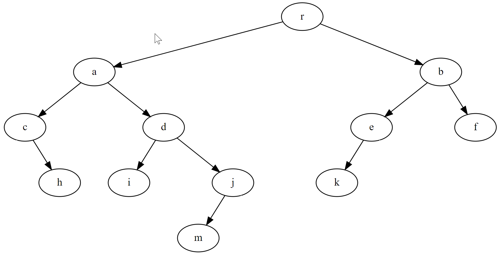

# Arbres binaires

## Définitions
+ Un arbre binaire est un arbre pour lequel tout sommet a au plus deux fils,
un fils gauche et un fils droit.



+ **Hauteur:**
c'est la plus grande distance entre la racine et une feuille.

*Dans l'exemple: hauteur = 4*


**Les différents parcours d'un arbre binaire**
==============================================

+ **Parcours préfixe:**
Dans la balade autour d'un arbre (à gauche
d'abord): chaque sommet est traité la première fois qu'on le rencontre dans la
balade.

*Dans l'exemple: r, a, c, h, d, i, j, m, b, e, k, f*

+ **Parcours postfixe (ou suffixe):**
Dans la balade autour d'un arbre (à gauche
d'abord): chaque sommet est traité la dernière fois qu'on le rencontre dans la
balade.

*Dans l'exemple: h, c, i, m, j, d, a, k, e, f, b, r*

+ **Parcours infixe:**
Chaque noeud ayant un fils gauche est traité la seconde
fois qu'on le rencontre dans la balade, chaque noeud sans fils gauche est
traité la première fois qu'on le rencontre dans la balade.

*Dans l'exemple: c, h, a, i, d, m, j, r, k, e, b, f*

**Implémentation de l'arbre à l'aide de listes**
```python
def noeud(nom, fg = None, fd = None) :
    return {'racine': nom, 'fg' : fg, 'fd': fd}

k = noeud('k')
f = noeud('f')
e = noeud('e', k, None)
b = noeud('b', e, f)
m = noeud('m')
j = noeud('j', m, None)
i = noeud('i')
d = noeud('d', i, j)
h = noeud('h')
c = noeud('c', None, h)
a = noeud('a', c, d)
A = noeud('r', a, b)


def construit(arbre) :
	if arbre == None : return []
	else : return [arbre['racine'],  construit(arbre['fg']), construit(arbre['fd']) ]


def parcoursPrefixe(arbre) :
    if(arbre != []) :
        print(arbre[0], end = ',')
        parcoursPrefixe(arbre[1])
        parcoursPrefixe(arbre[2])

def parcoursPostfixe(arbre) :
    if(arbre != []) :
        parcoursPostfixe(arbre[1])
        parcoursPostfixe(arbre[2])
        print(arbre[0], end = ',')

def parcoursInfixe(arbre) :
    if(arbre != []) :
        parcoursInfixe(arbre[1])
        print(arbre[0], end = ',')
        parcoursInfixe(arbre[2])


print("Parcours préfixe : ")
parcoursPrefixe(construit(A))


print('\n')
print("Parcours postfixe : ")
parcoursPostfixe(construit(A))

print()
print("\nParcours infixe : ")
parcoursInfixe(construit(A))
```


**Implémentation de l'arbre à l'aide d'un dictionnaire**
```python
A = { 'r' : ['a','b'], 'a' : ['c','d'], 'b' : ['e','f'], \
	'c' : ['','h'], 'd' : ['i', 'j'], 'e' : ['k',''], 'f' : ['',''], \
     'h' : ['',''], 'i': ['',''], 'j' : ['m',''], 'k' : ['',''], 'm' : ['','']}


def hauteur(arbre, noeud='r') :
	""" hauteur d'un arbre non vide"""
	if arbre[noeud][0] == '' and arbre[noeud][1] == '' : return 0
	elif arbre[noeud][0] == '' : return 1 + hauteur(arbre, arbre[noeud][1])
	elif arbre[noeud][1] == '' : return 1 + hauteur(arbre, arbre[noeud][0])
	else : return 1 + max( hauteur(arbre, arbre[noeud][0]), hauteur(arbre, arbre[noeud][1]) )


def parcoursPrefixe(arbre, noeud='r') :
    if(noeud != '') :
        print(noeud, end = ',')
        parcoursPrefixe(arbre, arbre[noeud][0])
        parcoursPrefixe(arbre, arbre[noeud][1])

def parcoursPostfixe(arbre, noeud='r') :
    if(noeud != '') :
        parcoursPostfixe(arbre, arbre[noeud][0])
        parcoursPostfixe(arbre, arbre[noeud][1])
        print(noeud, end = ',')


def parcoursInfixe(arbre, noeud='r') :
    if(noeud != '') :
        parcoursInfixe(arbre, arbre[noeud][0])
        print(noeud, end = ',')
        parcoursInfixe(arbre, arbre[noeud][1])


print("Hauteur de l'arbre : ")
print(hauteur(A))

print()
print("Parcours préfixe : ")
parcoursPrefixe(A)

print('\n')
print("Parcours postfixe : ")
parcoursPostfixe(A)

print('\n')
print("Parcours infixe : ")
parcoursInfixe(A)
```
